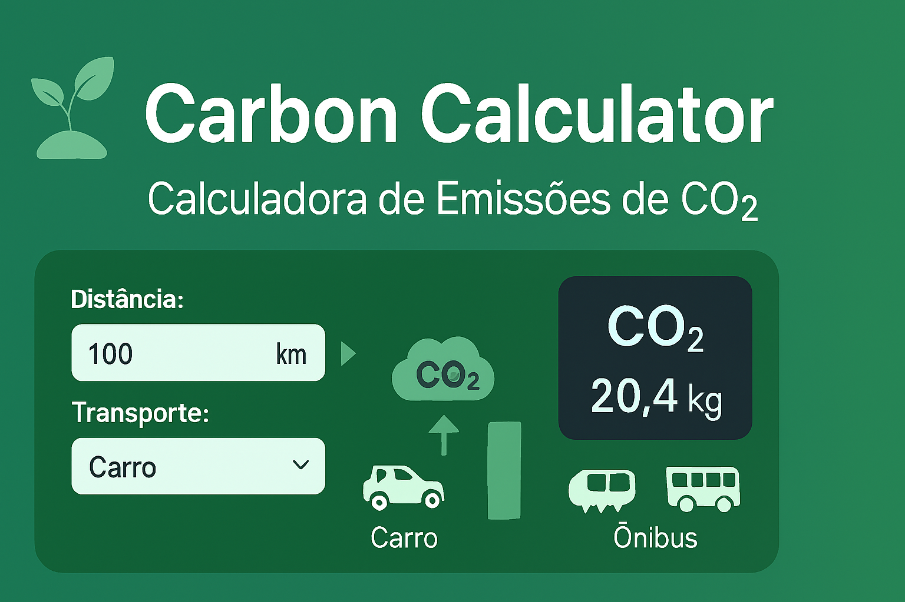

# 🌱 Carbon Calculator – Calculadora de Emissões de CO₂

Este projeto foi desenvolvido em **HTML, CSS e JavaScript** com foco em acessibilidade, responsividade e experiência moderna de usuário.  
O objetivo é oferecer uma ferramenta prática para calcular e visualizar emissões de carbono em diferentes meios de transporte, com comparações interativas e relatórios visuais.

---

## 🏅 Insígnias
📦 Repositório GitHub  
📄 Licença: MIT  

---

## 📋 Índice / Sumário
- 📖 Descrição  
- ⚙️ Funcionalidades  
- 🚀 Execução  
- 🌐 Acesso  
- 🧰 Tecnologias  
- 👨‍💻 Desenvolvedor  
- 📜 Licença  
- 🏁 Conclusão  

---

## 📖 Descrição
A **Carbon Calculator** é uma aplicação web que permite calcular emissões de CO₂ com base na distância percorrida e no meio de transporte escolhido.  
O sistema apresenta resultados em tempo real, com gráficos, comparações e sugestões de compensação de créditos de carbono.

**Principais características:**
- Interface moderna e responsiva  
- Suporte a **dark mode**  
- Uso de **CSS variables** e seletores modernos (`:has`)  
- Resultados exibidos em **cards interativos** e **gráficos comparativos**  

---

## ⚙️ Funcionalidades
🧩 Funcionalidade | 💡 Descrição
---|---
📤 Entrada de dados | Usuário informa distância e tipo de transporte  
🧮 Cálculo automático | Emissões de CO₂ calculadas em tempo real  
📊 Comparação visual | Comparação entre diferentes meios de transporte  
🌗 Dark Mode | Alternância entre tema claro e escuro  
🖼 Resultados interativos | Cards e gráficos animados para exibir dados  
💳 Créditos de carbono | Simulação de compensação e histórico de créditos  

---

## 🚀 Execução
1. Abra o arquivo `index.html` em qualquer navegador moderno.  
2. Insira os dados de transporte e distância.  
3. Visualize os resultados em tempo real.  
4. Explore comparações e opções de compensação.  

---

## 🌐 Acesso
- 🔗 Projeto disponível localmente via `index.html`  
- Repositório GitHub  

---

## 🧰 Tecnologias
- HTML5  
- CSS3 (variáveis, gradientes, animações, dark mode)  
- JavaScript (DOM, cálculos, interatividade)  

---

## 👨‍💻 Desenvolvedor

- [Ronaldo](https://github.com/Ronaldo94-GITHUB)

---

## 📜 Licença
Este projeto está sob licença MIT. Para mais detalhes, veja o arquivo LICENSE.  

---

## 🏁 Conclusão
A **Carbon Calculator** oferece uma solução prática e escalável para conscientização ambiental, permitindo que usuários calculem e comparem emissões de carbono de forma simples e visual.  
Ideal para aplicações em **educação ambiental, mobilidade urbana, e-commerce sustentável ou relatórios corporativos**.  
